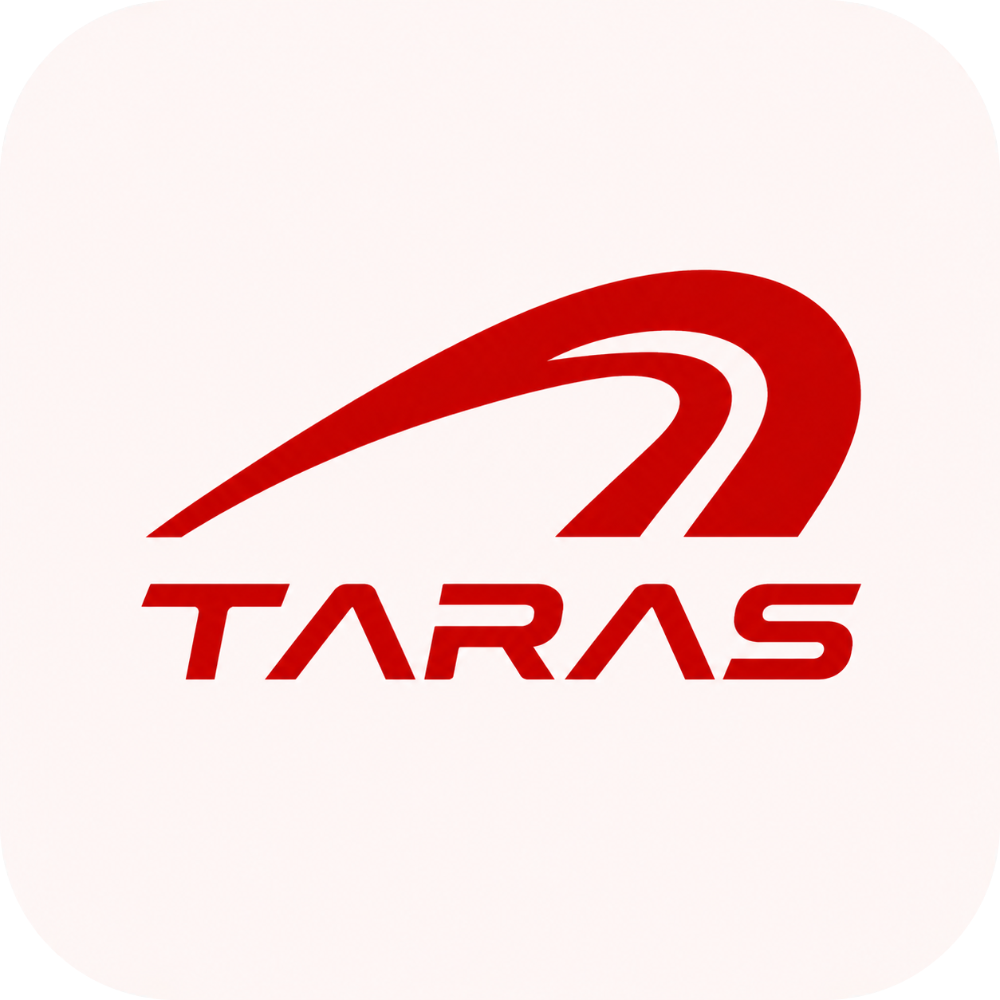
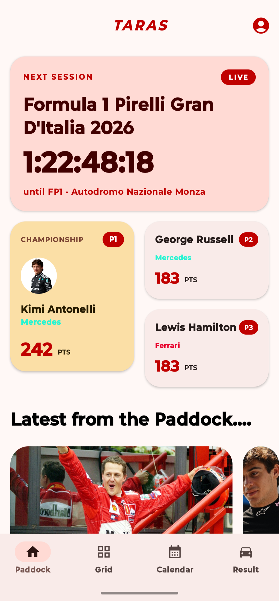
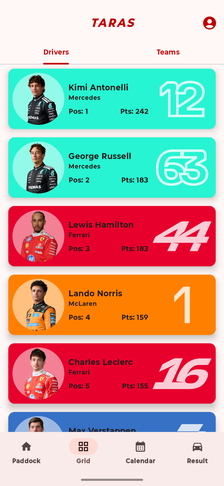
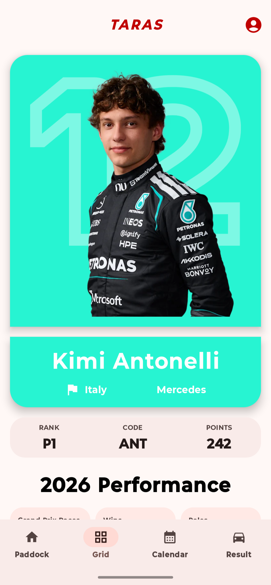
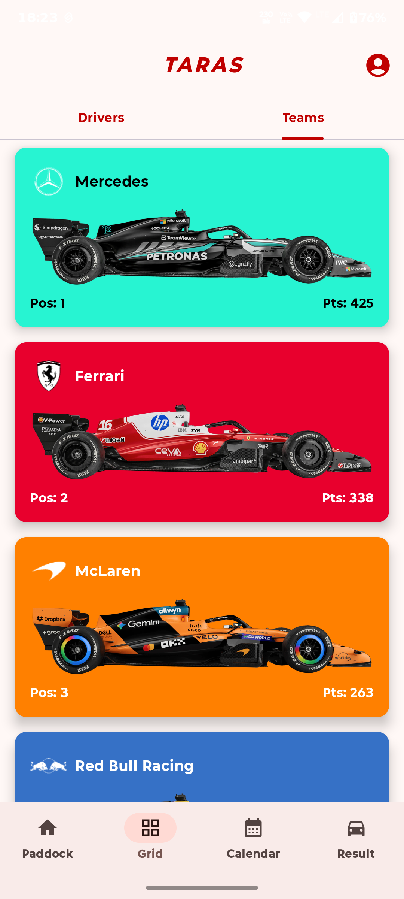
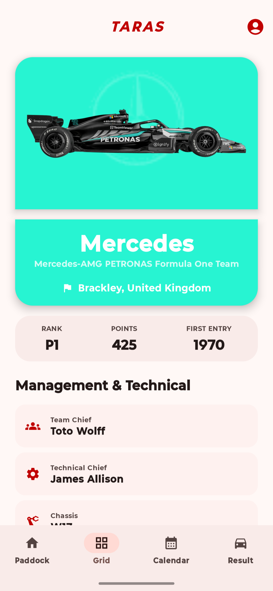
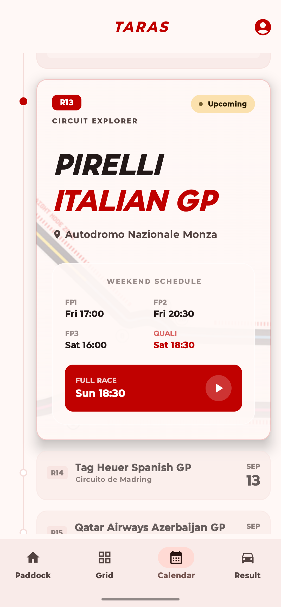
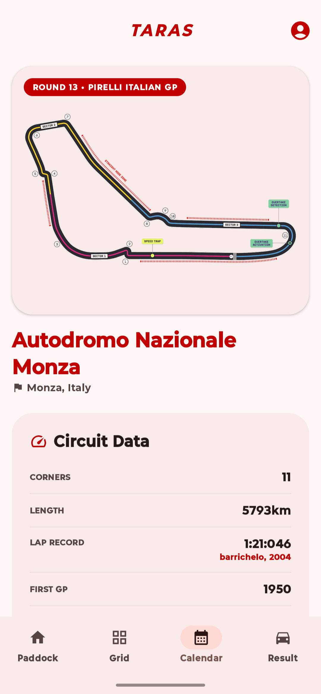
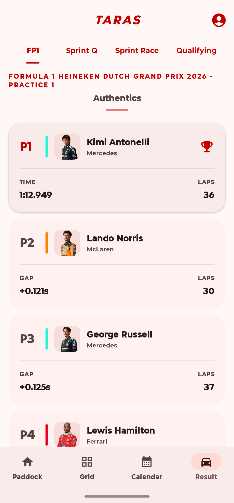
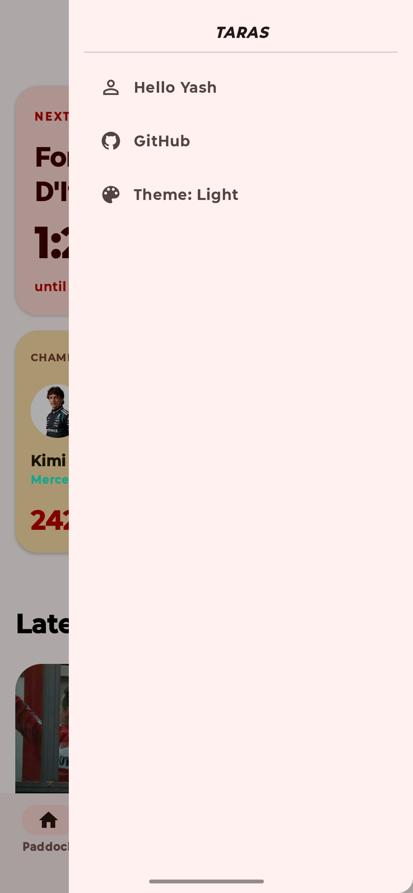

# Taras (तरस्) 🏎️

<p align="center">
  
</p>

<p align="center">
  <strong>A high-performance Formula 1 data application for Android</strong><br>
  Built with Jetpack Compose, Material Design 3, and modern Android architecture.
</p>

<p align="center">
    
    
    
</p>

---

## 🏎️ Philosophy & Motivation

**Taras (तरस्)** in Sanskrit translates to **"speed," "velocity," "energy,"** or **"strength."** It perfectly encapsulates the essence of Formula 1—a sport defined by swiftness and powerful force.

As a fan of F1, I built Taras to solve a personal need for a clean, minimalist, and performance-driven data tool. This project serves as a cornerstone of my professional portfolio, demonstrating my ability to architect complex Android applications that handle multi-source data streams, robust offline persistence, and modern UI patterns.

---

## 📱 Screenshots

<p align="center">
  
  
  
  <br>
  <em><b>Paddock (News Feed)</b>    |    <b>Grid (Drivers)</b>    |    <b>Driver Profile</b></em>
  <br><br>
  
  
  
  <br>
  <em><b>Grid (Teams)</b>    |    <b>Team Profile</b>    |    <b>Calendar (Race Weekend)</b></em>
  <br><br>
  
  
  
  <br>
  <em><b>Circuit Profile</b>    |    <b>Session Results</b>    |    <b>Navigation Drawer</b></em>
</p>

---

## ✨ Key Features

### 🗞️ The Paddock (News)
- **Aggregated RSS Feeds**: Powered by **Ksoup** for high-speed parsing of the latest headlines.
- **In-App Consumption**: Read summaries and view full articles without leaving the application.

### 👥 The Grid (Profiles & Analytics)
- **Deep Driver/Team Insights**: Comprehensive stats, history, and Branding-aware UI.
- **Performance Visualization**: Interactive performance charts using **Compose Charts**.
- **Top 3 Persistence**: Real-time tracking of championship leaders cached via **Room**.

### 🗓️ Race Weekend Calendar
- **Precision Timings**: Automated countdowns to every session (FP1, FP2, FP3, Qualy, Sprint, Race).
- **Circuit Intelligence**: Technical circuit details accompanied by high-quality track maps.

### ⚙️ Technical Highlights
- **Offline-First Architecture**: Seamless experience using **Room** and **DataStore** for caching and preferences.
- **Custom Notifications**: A self-hosted notification flow via **GitHub Actions** and **WorkManager**, avoiding heavy third-party dependencies like Firebase.
- **Material 3 / Dynamic Color**: A minimalist "Google-style" aesthetic with full support for system-wide dynamic theming.

---

## 🛠️ Tech Stack

| Category | Technology | Purpose |
|----------|------------|---------|
| **UI** | [Jetpack Compose](https://developer.android.com/jetpack/compose) | Declarative UI development |
| **Design** | [Material Design 3](https://m3.material.io/) | Google-style minimalist design system |
| **Navigation** | [Navigation 3](https://developer.android.com/jetpack/compose/navigation) | Modern, type-safe navigation |
| **Networking** | [Retrofit](https://square.github.io/retrofit/) | Primary API communication |
| **XML/RSS** | [Ksoup](https://github.com/fleeksoft/ksoup) | Fast parsing of F1 news feeds |
| **Database** | [Room](https://developer.android.com/training/data-storage/room) | Local data persistence for profiles/standings |
| **Preferences** | [DataStore](https://developer.android.com/topic/libraries/architecture/datastore) | Reactive user settings management |
| **Visuals** | [charts](https://github.com/HDCharts/charts) | Data visualization and trend analysis |
| **Background** | WorkManager | Reliable background sync and notifications |

---

## 🚧 Challenges & Roadmap

This project is a continuous learning experience. Here are some of the technical challenges I've navigated:

- **Widget Synchronization**: Managing Home Screen widget (Glance) refreshes against Android's strict battery optimization policies remains an active area of refinement.
- **Live Data Evolution**: While the app currently excels at post-session data, I am prototyping real-time session tracking using WebViews and official telemetry streams.
- **Automated Scraper (GitHub Actions)**: Moving from static RSS to a full-scale automated scraper that will aggregate data from multiple major outlets into the [TarasF1Data](https://github.com/yashajagiya/tarasF1Data) backbone.
- **Workflow Reliability**: Improving the stability of my custom notification flow to ensure 100% delivery without relying on Firebase Cloud Messaging.

---

## 📂 Project Structure

```
app/src/main/java/com/example/taras/
├── core/
│   ├── common/             # Shared utilities, Internet receivers, and UiState
│   ├── db/                 # Room Database & DAOs (Offline Persistence)
│   ├── notification/       # WorkManager logic for GitHub-based broadcasts
│   └── UserPreferences.kt  # DataStore for global settings
├── network_calls/
│   ├── taras/              # Primary API (TarasF1Data)
│   ├── openf1/             # Secondary API integration
│   ├── rss/                # News feed parsing
│   ├── ApiConstants.kt     # Centralized endpoints
│   └── NetworkModule.kt    # Dependency Injection for Networking
├── ui/theme/               # Material 3 Design System
├── view/
│   ├── MainActivity.kt     # App Entry Point
│   ├── scaffold/           # Navigation 3 Graph and Layouts
│   └── subview/            # Component-based UI elements
└── viewmodel/              # Feature-specific state management
```

---

## 🚀 Getting Started

### Prerequisites
- Android Studio Ladybug (2024.2.1+)
- Android SDK 24+
- JDK 11+

### Installation
1. `git clone https://github.com/yashajagiya/Taras.git`
2. Open the project in Android Studio.
3. Sync Gradle and build via `Build -> Make Project`.

---

## 🙏 Credits & Acknowledgements

- **AI Co-pilot**: A huge thanks to **Gemini** for its role as a professional tool in debugging, suggesting architectural patterns, and solving complex logic problems.
- **UI Inspiration**: Design system and minimalist layouts were inspired by [stitch.withgoogle.com](https://stitch.withgoogle.com/).
- **Data Backbone**: Built upon [TarasF1Data](https://github.com/yashajagiya/tarasF1Data), my personal repository for scraping and hosting F1 data from multiple APIs and web sources.

---

## 📄 License
Distributed under the Apache 2.0 License. See `LICENSE` for more information.

<p align="center">
  Made by <a href="https://github.com/yashajagiya">yashajagiya</a> 🏎️🏆❤️
</p>
